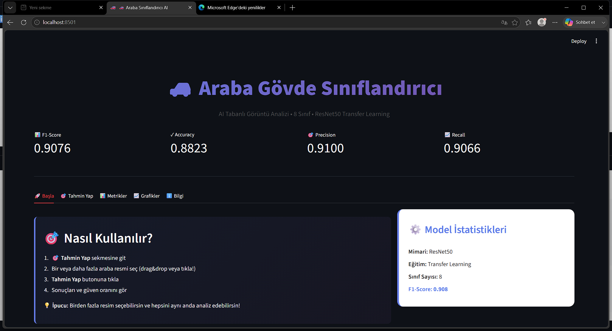
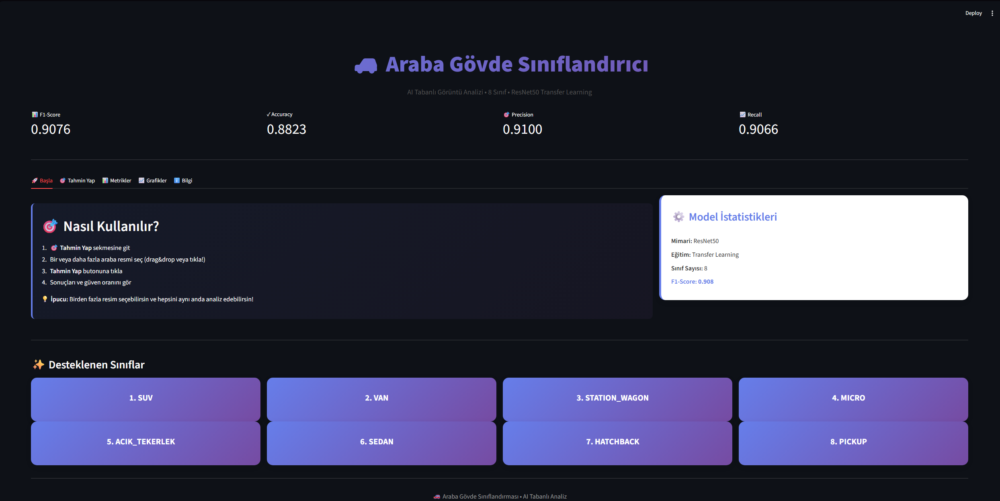
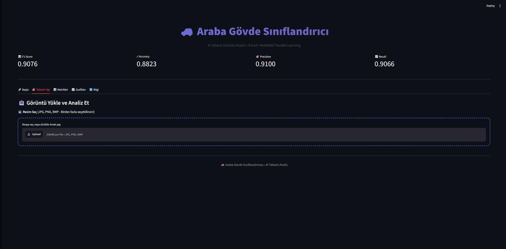
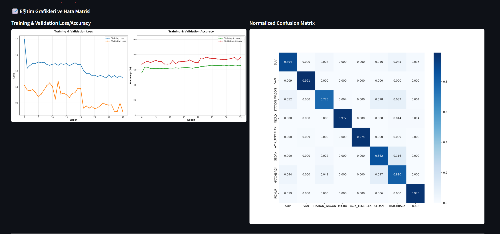
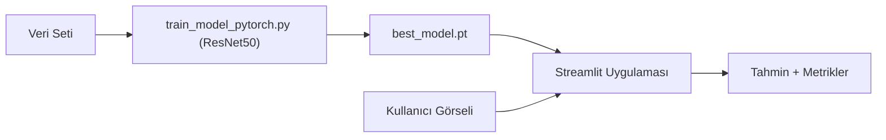

# Araba Gövde Sınıfı Sınıflandırıcı

ResNet50 tabanlı transfer learning ile araç görsellerinden gövde tipini (SUV, Sedan, Hatchback, Station Wagon, Pick-Up, Van, Micro, Açık Tekerlek) tahmin eden bir görüntü sınıflandırma projesi. Streamlit tabanlı bir web arayüzü ile tahmin, metrik ve grafik görüntüleme sağlar.



*Gerçek eğitilmiş model (Git LFS ile) yüklenip çalıştırılmış hâli.*

## Ekran Görüntüleri

| | |
|---|---|
| **Ana Sayfa** — desteklenen 8 sınıf | **Tahmin Yap** — görüntü yükleme arayüzü |
|  |  |
| **Grafikler** — eğitim eğrileri ve karışıklık matrisi | **Bilgi** — model mimarisi ve eğitim ayarları |
|  |  |

## Mimari



## Sonuçlar (test seti)

| Metrik | Değer |
|---|---|
| Accuracy | 0.882 |
| F1-Score (macro) | 0.908 |
| F1-Score (weighted) | 0.883 |
| Precision (macro) | 0.910 |
| Recall (macro) | 0.907 |

Sınıf başına metrikler ve karışıklık matrisi için `models/model_info.json` ve `reports/` klasörüne bakın.

## Model

- **Mimari:** ResNet50 (ImageNet ön-eğitimli), özel bir tam bağlantılı katman ile (2048→1024→512→8 sınıf, BatchNorm + ReLU + Dropout)
- **Eğitim:** Transfer learning + fine-tuning, 68 epoch, SGD + momentum, LinearLR + ReduceLROnPlateau, early stopping
- **Veri artırma:** rotation ±45°, scale 0.85-1.15, affine translation, ColorJitter, RandomCrop, RandomErasing
- **Tahmin:** TTA (Test-Time Augmentation) — orijinal, yatay flip ve kırpma varyantlarının ortalaması

## Teknoloji

- Python, PyTorch / torchvision
- Streamlit (web arayüzü), Plotly, Matplotlib, Seaborn
- scikit-learn (metrikler)

## Kurulum

```bash
pip install -r requirements.txt
```

## Çalıştırma

Eğitilmiş model ağırlıkları (`models/best_model.pt`, ~150 MB) Git LFS ile bu repoya dahildir. Klonladıktan sonra doğrudan arayüzü çalıştırabilirsiniz:

```bash
git lfs pull   # LFS kurulu değilse: https://git-lfs.com
streamlit run app.py
```

Modeli kendi veri setinizle yeniden eğitmek isterseniz:

```bash
python train_model_pytorch.py --device cpu   # veya cuda / dml
```

Windows'ta `RUN.bat` ile sanal ortam kurulumu, eğitim ve arayüz başlatma otomatik yapılır.

## Yardımcı betikler

Veri seti hazırlama/temizleme (`split_dataset.py`, `merge_external_dataset.py`, `scan_bad_images.py`, `audit_mislabeled_images.py`, `fix_labels_from_audit.py`), değerlendirme (`evaluate_model.py`, `show_confused.py`, `show_errors.py`) ve teslimat hazırlama (`prepare_submission.py`, `verify_submission.py`) için betikler dahildir.
